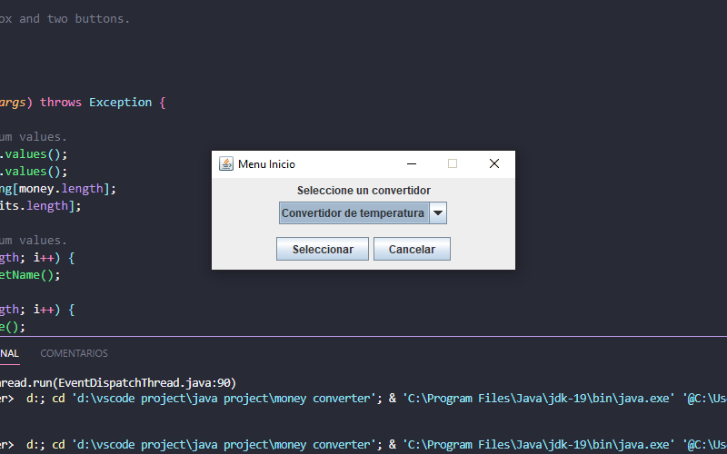
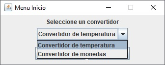
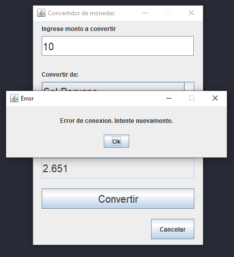

# Convertidor de monedas y temperatura

Convertidor de monedas y  temperatura con las siguientes caracteristicas

## Convertidor de monedas y temperatura

Menu de inicio para seleccionar el tipo de convertidor

## Caracteristicas convertidor de monedas

- Convierte entre: 
    - Dólar Americano 
    - Sol Peruano 
    - Libra Esterlina 
    - Yen Japones
    - Won Sur-coreano 

  

- Los datos para conversion de monedas son recibidos desde la API.
  - https://github.com/fawazahmed0/currency-api#readme

## Caracteristicas convertidor de temperatura

- Convierte entre 
    - Grados Celcius 
    - Grados Fahrenheit 
    - Grados Kelvin

 

## Capturas de pantalla

 
 

## 🔗 Links de autor

## Autor

- [@robertrengel](https://www.github.com/robertrengel)

